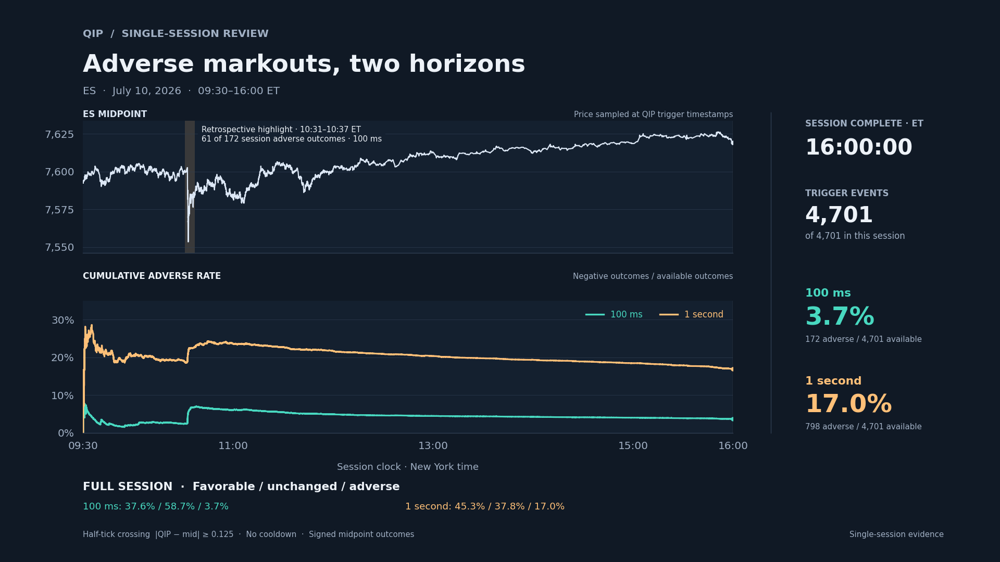

# QIP: Adverse-Selection Markouts and Execution-State Measurement

**William Karkut. — quantitative execution and market microstructure research**

I do not need to win a latency race; I need to avoid unnecessarily handing over value to the firms that do.

QIP (Quantum-Inspired Price) is a proprietary limit-order-book fair-price estimator that extends Stoikov’s microprice framework. This repository evaluates supplied QIP estimates as a potential execution-state signal and follows the evidence from directional midpoint behavior through a hypothetical aggressive execution test, with explicit clocks, spread costs and outcome counts. The QIP estimator itself is not included.

On July 10, 2026, **3.7% of 4,701 QIP trigger events** were followed by an adverse midpoint move at 100 ms. Favorable moves accounted for 37.6%; the midpoint was unchanged in 58.7% of windows. Among windows in which the midpoint changed, 91.1% moved with the signal.

That directional behavior was **not profitably captured by simply crossing the spread**. Average aggressive capture remained negative at every valid tested delay and horizon.

That distinction matters: short-horizon microstructure information may be useful without being a standalone trading signal; it may instead belong inside the execution decision itself. This study measures that problem; it does not claim to have solved the execution policy.

[](media/qip_review.mp4)

[Open the 25-second MP4](media/qip_review.mp4). Teal is 100 ms; amber is 1 second. The price line is sampled at trigger events. The percentage curves include every valid event and reveal each outcome at completed-bar availability.

## Why this is not a cross-the-spread signal

The aggressive-execution test asks a deliberately simple question: is the directional movement following a QIP trigger large enough to justify immediately crossing the spread?

On July 10, it was not. At 100 ms, the mean signed midpoint move was **+0.29 tick**, while the mean recorded entry/exit spread cost was **1.08 ticks**. The resulting mean gross outcome was **−0.79 tick**, with a median loss of exactly **one tick**. At 1 second, the mean gross outcome remained negative at **−0.74 tick**, with the same one-tick median loss.

This does not negate the directional markout result. It shows that the information identified by QIP was not large enough on this session to justify paying the spread simply to capture the subsequent short-horizon move. That distinction is why QIP is evaluated here as an execution-state signal rather than as an instruction to take liquidity immediately.

| Zero-delay cross-the-spread scenario | Mean signed midpoint move | Mean entry/exit spread cost | Mean gross outcome | Median gross outcome |
| --- | ---: | ---: | ---: | ---: |
| Exit at 100 ms | +0.29 tick | 1.08 ticks | −0.79 tick | −1.00 tick |
| Exit at 1 second | +0.32 tick | 1.06 ticks | −0.74 tick | −1.00 tick |

For the recorded-touch model, the identity is:

**Gross outcome = signed midpoint movement − half the entry spread − half the exit spread.**

With a constant one-tick spread and no midpoint movement, buying at the ask and selling at the bid loses one tick in total. The observed spreads vary, so the mean spread cost is slightly more than one tick. Favorable average midpoint movement partly offsets that cost but does not cover it.

These results establish a low incidence of adverse **midpoint markouts following QIP displacement on this session**: 172 of 4,701 events, or 3.7%, were adverse at 100 ms. That is evidence that QIP is identifying short-horizon states relevant to adverse-selection risk.

The study establishes a measurable basis for potential fill-level improvement by identifying market states associated with unusually low subsequent adverse midpoint markouts, but actual improvement in realized fills would require testing a QIP-conditioned execution policy.

The study does not claim that QIP eliminates adverse selection. Passive orders, actual fills, queue position and successful cancellations were not measured.

## Why this matters beyond a 100 ms trade

The investment horizon and the execution horizon are different problems. At trivial size, spread cost can be economically small relative to a position held for days or weeks. The execution problem changes as order size approaches or exceeds available liquidity, when depth, market impact and information leakage begin to matter alongside the displayed spread.

A larger position may require multiple child orders, resizing, hedging, rolling and eventual exit. Each creates a new execution decision regardless of how long the underlying investment thesis is held. Execution cost is therefore driven less by the holding period than by the size and urgency of the order relative to available liquidity and by how often an investment decision must be translated into market orders.

Those larger-size effects are **not measured in this repository**. The purpose of this study is to establish the measurement layer needed before designing execution around QIP. A customized execution process should begin by measuring the short-horizon behavior its trading, waiting, cancellation and liquidity-taking decisions are intended to improve.

## Directional behavior and aggressive capture

All entries below use the same 4,701 events, the primary strict-before clock and zero assumed action delay. Gross capture already includes the entry/exit spread; commissions and additional slippage are not supplied.

| Horizon | Midpoint favorable / unchanged / adverse | Gross capture positive / zero / negative | Mean gross outcome, points |
| --- | --- | --- | ---: |
| 100 ms | 37.6% / 58.7% / 3.7% | 0.9% / 26.2% / 72.9% | −0.197 |
| 1 second | 45.3% / 37.8% / 17.0% | 11.0% / 31.4% / 57.7% | −0.185 |

At 100 ms, the exact gross capture counts are **43 positive, 1,233 zero and 3,425 negative**. The median describes the middle observation; it does not mean every outcome loses one tick.

The tick study reports signed midpoint markouts by horizon:

| Horizon after bar availability | Adverse midpoint rate | Mean signed midpoint move, points |
| --- | ---: | ---: |
| 10 ms | 0.9% | +0.037 |
| 20 ms | 1.3% | +0.050 |
| 50 ms | 2.4% | +0.066 |
| 100 ms | 3.7% | +0.073 |
| 250 ms | 6.8% | +0.085 |
| 500 ms | 11.1% | +0.088 |
| 1 second | 17.0% | +0.079 |

At the shortest horizons, some target observations still resolve to the same prevailing source state as entry. These rows therefore should not be read as a clean decomposition of how the signal develops through time. In the delay sweep, the exit remains fixed at decision time plus the horizon; delaying entry reduces the remaining holding time. Average aggressive capture is negative at every valid tested delay and horizon.

## Stress interval and clock sensitivity

The retrospective **10:31–10:37 ET** interval contains 203 events and 61 of the session's 172 adverse 100 ms outcomes. Its adverse rate is 30.0%, versus 2.5% over the rest of the session. Both contribute to the headline 3.7%; the fast interval is retained throughout. The outside-window rate is not a corrected estimate.

The primary lookup uses the last tick strictly before each observation time. A separately labeled sensitivity includes all ticks stamped at that same millisecond. At zero delay, this changes mean gross capture from −0.197 to −0.208 points at 100 ms, and from −0.185 to −0.197 points at 1 second. The economic conclusion is unchanged under these two conventions. They are sensitivity cases, not guaranteed bounds on actual execution.

## Measurement contract

- **Session:** July 10, 2026, selected by recency before its outcomes were evaluated. RTH is 09:30–16:00 America/New_York, corresponding to 13:30–20:00 UTC on this date. This implementation handles regular full-length sessions.
- **Triggers:** existing 50 ms bar-selected crossings of `abs(qip - mid) >= 0.125` points. Retrigger after falling below the threshold or a direction flip while above it; no cooldown. The evaluator preserves the preceding pre-RTH state at the open.
- **QIP configuration:** the July 10 study uses one fixed, pre-existing QIP parameterization; no QIP parameters were selected or tuned using the July 10 outcomes.
- **Availability:** stored grid labels denote bar starts. Decisions become available at `DateTime + 50 ms`. The original event file retains its original labels. The tick study and this renderer apply the bar-close convention explicitly; shifting both endpoints leaves the grid horizons and classifications unchanged.
- **Tick reconstruction:** all 4,701 trigger QIP/mid/bid/ask states match the last tick strictly before bar close. Trigger-state age is 5 ms at the median, 30 ms at the 95th percentile and 50 ms at the maximum. Every trigger bin contains an update.
- **Source clock:** 5,760,236 valid RTH tick rows, with millisecond-aligned timestamps and duplicate timestamps in file order. Integer timestamps match `DateTime` interpreted as UTC. That checks internal consistency; source-event versus receipt-time provenance and live feed latency remain unmeasured. The source timestamps have millisecond resolution, so sub-millisecond ordering—including 400 μs—cannot be recovered.
- **Timing:** signed midpoint movement at 10/20/50/100/250/500/1,000 ms after availability. Lookups use the recorded prevailing state before the target, without waiting for a later update or excluding old quotes. Quote ages are reported. The optional at-or-before timing rows change the entry and target observations but keep the original trigger set and direction fixed.
- **Capture:** hypothetical infinitesimal long entry/exit at ask/bid, or short entry/exit at bid/ask. Entry is `t0 + delay`; exit is `t0 + horizon`. Delays are 0/5/10/20/50/100 ms; capture horizons are 100/1,000 ms. `remaining_hold_ms = horizon_ms - delay_ms`; nonpositive holds are unavailable.
- **Accounting:** favorable/unchanged/adverse midpoint counts and positive/zero/negative capture counts use their own explicit fields. Unavailable observations never become zero outcomes. Counts reconcile to each scenario's valid denominator. No cost argument means all net capture metrics are null; supplying zero costs is a different, explicit assumption.
- **Scope:** this is a one-session study. Triggers cluster and their outcome windows overlap, so the 4,701 events are not independent observations; no event-independent confidence interval is reported or implied by the sample size. The execution study is a hypothetical recorded-touch benchmark for infinitesimal aggressive execution, not an actual-fill study. Size, market impact, slippage and passive-order queue/cancellation behavior are not modeled.

## Files and reproduction

| File | Purpose |
| --- | --- |
| `tick_timing.py` | Tick-level timing and recorded-touch capture study |
| `test_tick_timing.py` | Boundary, serialization and accounting tests |
| `evaluate.py` | 50 ms trigger and grid markout evaluator |
| `render.py` | Three-line replay renderer |
| `pyproject.toml`, `poetry.lock` | Locked dependencies |
| `results/events_2026-07-10.parquet` | 4,701 trigger events with grid outcomes |
| `results/summary_2026-07-10.csv` | Five-horizon summary; 5 s has 4,700 valid events |
| `results/manifest_2026-07-10.json` | Grid-run provenance and hashes |
| `results/report_2026-07-10.json` | Tick-study report with source and script hashes |
| `media/` | MP4 replay and closing-frame preview |

Requires Python 3.12 or later; dependencies are locked with Poetry. Commands run from the repository root.

```powershell
poetry install
poetry run python -m unittest test_tick_timing -q
poetry run python render.py --events results/events_2026-07-10.parquet --output media/qip_review_local.mp4
```

The included event data are sufficient to reproduce the published replay and inspect the reported grid markouts. The included test suite can be run independently. Re-running the tick-level study requires the external source tick data; rebuilding the event corpus additionally requires the private QIP grid. Neither the QIP estimator nor those raw source files is included.

